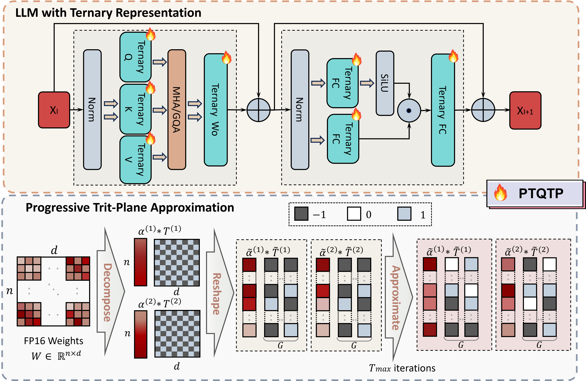

# PTQTP: Post-Training Quantization to Trit-Planes for Large Language Models

## The codes will be released as soon as possible after the review.

Post-training quantization (PTQ) of large language models (LLMs) to extremely low bit-widths faces the challenge of balancing hardware efficiency with representational capacity.  While recent 1-bit PTQ methods achieve binary \(\{-1, 1\}\) bit-plane approximation, their reliance on unstructured weight categorization limits both hardware efficiency and expressiveness. We introduce **PTQ** to **T**rit-**P**lanes (PTQTP), a novel structured PTQ framework that decomposes weights into ternary \(\{-1, 0, 1\}\) trit-planes, constituting the *first-ever* effective 1.58-bit PTQ scheme without retraining. PTQTP enjoys: (1) a structured and uniform decomposition that enhances representational power while maintaining computational simplicity; (2) a model-agnostic algorithm for seamless plug-and-play across diverse advanced LLMs (e.g., LLaMA3.x, Qwen3 family); and (3) a progressive approximation strategy ensuring global consistency without additional calibration. Experiments demonstrate that PTQTP outperforms state-of-the-art (SOTA) low-bit PTQ methods and even approaches/surpasses 1.58-bit quantization-aware training (QAT) performance on various mainstream benchmarks, thereby establishing a new paradigm for deploying LLMs on resource-constrained platforms.

